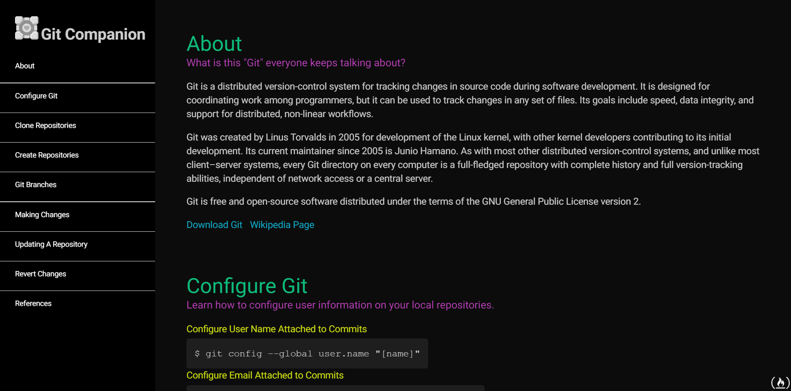

# Tech Page

Part of freeCodeCamp.org responsive web design curriulum requirement. Objective was to use vanilla JavaScript, HTML, & CSS to create a technical documentation page.

## Tech Stack

* JavaScript
* HTML
* CSS
* Sass
* Materialize

## Link

https://emirvelazquez.github.io/techPage/

## Preview

